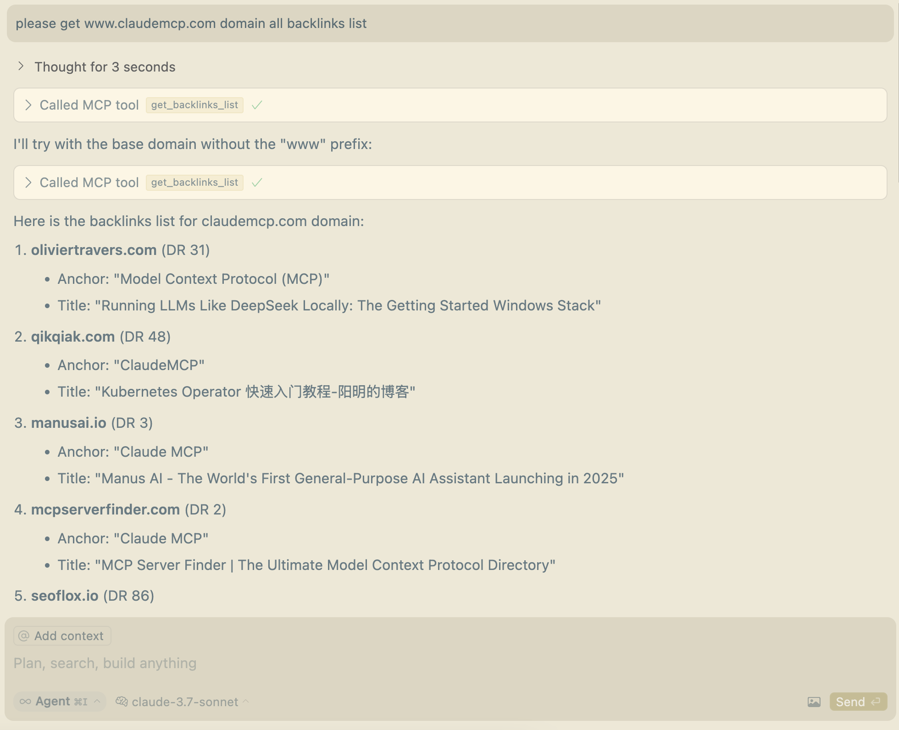

# Backlinks MCP

A MCP (Model Control Protocol) service for retrieving backlink information for any domain using Ahrefs' data.

## Overview

This service provides an API to retrieve backlink data for websites. It handles the entire process including captcha solving, authentication, and data retrieval from Ahrefs. The results are cached to improve performance and reduce API costs.

> This MCP server is only for learning purposes, please do not abuse it, otherwise the consequences will be self-responsible. This project is inspired by `@哥飞社群`.

About this MCP Server, please refer to the introduction of [Claude MCP Backlinks MCP](https://www.claudemcp.com/servers/backlinks-mcp).

## Features

- 🔍 Retrieve backlink data for any domain
- 🔒 Automatic captcha solving with CapSolver
- 💾 Signature caching to reduce API calls
- 🚀 Fast and efficient data retrieval
- 🧹 Simplified output with the most relevant backlink information

## Installation

### Prerequisites

- Python 3.8 or higher
- A CapSolver account and API key (register [here](https://dashboard.capsolver.com/passport/register?inviteCode=1dTH7WQSfHD0))
- `uv` installed (on macOS, you might need to install with `brew install uv`)

### Manual Setup

1. Clone the repository:

   ```bash
   git clone https://github.com/cnych/backlinks-mcp.git
   cd backlinks-mcp
   ```

2. Install FastMCP with uv:

   ```bash
   uv pip install fastmcp
   ```

3. Set up your CapSolver API key:
   ```bash
   export CAPSOLVER_API_KEY="your-capsolver-api-key"
   ```

## Usage

### Running the Service

You can use FastMCP to run the service in several ways:

#### Install in Claude Desktop

To install this server in Claude Desktop and interact with it right away:

```bash
fastmcp install src/backlinks_mcp/server.py
```

#### Test with the MCP Inspector

For development and testing:

```bash
fastmcp dev src/backlinks_mcp/server.py
```

#### Install in Cursor IDE

On Cursor Settings, switch to MCP tab, click the `+Add new global MCP server` button, then input the following content:

```json
{
  "mcpServers": {
    "Backlink MCP": {
      "command": "uvx",
      "args": ["backlinks-mcp"],
      "env": {
        "CAPSOLVER_API_KEY": "CAP-xxxxxx"
      }
    }
  }
}
```

Also, you can create a `.cursor/mcp.json` file in the project root directory and input the above content, so it's a project-specific MCP server.

> `CAPSOLVER_API_KEY` env can get from [here](https://dashboard.capsolver.com/passport/register?inviteCode=1dTH7WQSfHD0).

Next, we can use this MCP in Cursor:



### API Reference

The service exposes the following MCP tool:

#### `get_backlinks_list(domain: str)`

Retrieves a list of backlinks for the specified domain.

**Parameters:**

- `domain` (string): The domain to query (e.g., "example.com")

**Returns:**
A list of backlink objects, each containing:

- `anchor`: The anchor text of the backlink
- `domainRating`: The domain rating score (0-100)
- `title`: The title of the linking page
- `urlFrom`: The URL of the page containing the backlink
- `urlTo`: The URL being linked to
- `edu`: Boolean indicating if it's from an educational site
- `gov`: Boolean indicating if it's from a government site

**Example Response:**

```json
[
  {
    "anchor": "example link",
    "domainRating": 76,
    "title": "Useful Resources",
    "urlFrom": "https://referringsite.com/resources",
    "urlTo": "https://example.com/page",
    "edu": false,
    "gov": false
  },
  ...
]
```

## Development

For development purposes, you can clone the repository and install development dependencies:

```bash
git clone https://github.com/cnych/backlinks-mcp.git
cd backlinks-mcp
uv sync
```

## How It Works

1. The service first attempts to retrieve a cached signature for the domain
2. If no valid cache exists, it:
   - Solves the Cloudflare Turnstile captcha using CapSolver
   - Obtains a signature and validity period from Ahrefs
   - Caches this information for future use
3. Uses the signature to retrieve the backlinks data
4. Processes and returns the simplified backlink information

## Troubleshooting

- **CapSolver API Key Error**: Ensure your `CAPSOLVER_API_KEY` environment variable is set correctly
- **Rate Limiting**: If you encounter rate limits, try using the service less frequently
- **No Results**: Some domains may have no backlinks or may not be indexed by Ahrefs
- **Issues**: If you encounter issues with Backlinks MCP, check the [Backlinks MCP GitHub repository](https://github.com/cnych/backlinks-mcp) for troubleshooting guidance

## License

This project is licensed under the MIT License - see the LICENSE file for details.
